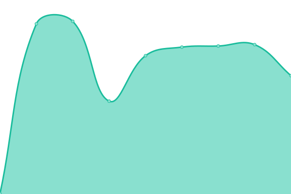

# [📈 Live Status](https://alexjp.github.io/wetest): <!--live status--> **🟥 Complete outage**

This repository contains the open-source uptime monitor and status page for [Alexandre Pereira](https://alexjp.github.io/wetest), powered by [Upptime](https://github.com/upptime/upptime).

With [Upptime](https://upptime.js.org), you can get your own unlimited and free uptime monitor and status page, powered entirely by a GitHub repository. We use [Issues](https://github.com/alexjp/wetest/issues) as incident reports, [Actions](https://github.com/alexjp/wetest/actions) as uptime monitors, and [Pages](https://alexjp.github.io/wetest) for the status page.

<!--start: status pages-->
<!-- This summary is generated by Upptime (https://github.com/upptime/upptime) -->
<!-- Do not edit this manually, your changes will be overwritten -->
<!-- prettier-ignore -->
| URL | Status | History | Response Time | Uptime |
| --- | ------ | ------- | ------------- | ------ |
|  [Weticlient](https://weticlient.ddns.net) | 🟥 Down | [weticlient.yml](https://github.com/alexjp/wetest/commits/HEAD/history/weticlient.yml) | 

 666ms
     
 | 

<a href="https://alexjp.github.io/wetest/history/weticlient">73.10%</a>
    

|  [Alternative](http://wetest.mine.nu) | 🟥 Down | [alternative.yml](https://github.com/alexjp/wetest/commits/HEAD/history/alternative.yml) | 

 762ms
     
 | 

<a href="https://alexjp.github.io/wetest/history/alternative">72.74%</a>
    

<!--end: status pages-->

[**Visit our status website →**](https://alexjp.github.io/wetest)

## 📄 License

- Powered by: [Upptime](https://github.com/upptime/upptime)
- Code: [MIT](./LICENSE) © [Alexandre Pereira](https://alexjp.github.io/wetest)
- Data in the `./history` directory: [Open Database License](https://opendatacommons.org/licenses/odbl/1-0/)
